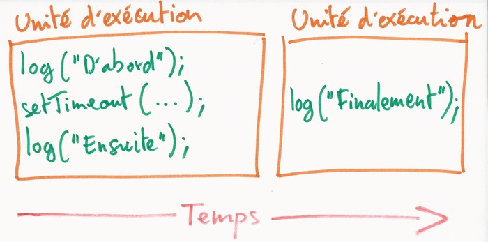

# L'asynchrone en JavaScript

- Alex Marandon
- Simon Bats

.fx: extra-large

---

# σύγ

*syn* : ensemble

Exemples : synthèse, synopsis, synchrétisme

.fx: extra-large

---

# χρονος

*chronos* : le temps

Exemples : chronologie, chronomètre

.fx: extra-large

---

# A-syn-chrone

Qui ne se fait pas en même temps.

* une partie du code s'exécute *maintenant*
* une partie s'exécute *plus tard*

---

# Exemple : timer

    !js
    log("Maintenant");

    setTimeout(function() {
        log("Plus tard");
    }, 2000);

    log("Maintenant aussi");

<button class="run"></button>

---

# Exemple : requête HTTP

    !js
    var xhr = new XMLHttpRequest();
    log("Maintenant");
    xhr.addEventListener("load", function() {
       log("Plus tard : " + this.responseText);
    });
    xhr.open("GET", "/data/greeting.txt", true);
    xhr.send(null);
    log("Maintenant aussi");

<button class="run"></button>

---

# Exemple : lecture d'un fichier

Code du serveur répondant à la requête précédente :

    !js
    var fs = require('fs'), http = require('http');

    http.createServer(function (req, res) {
      fs.readFile(__dirname + req.url, function (err, data) {
        res.writeHead(200);
        setTimeout(function() {  // Délai artificiel pour la démo
          res.end(data);
        }, 2000);
      });
    }).listen(8080);

---

# Les événements

L'exécution du code asynchrone est déclenchée par des événements.

Exemples :

- Un descripteur de fichier est prêt pour la lecture ou l'ecriture
- Un timer arrive à échéance
- Un événement est créé par l'utilisateur (clic de souris)
- Un signal est envoyé au processus

---

# La boucle d'évéments

Algorithme très simplifié :

    !js
    // Pseudo code
    while (true) {  // Boucle sans fin

       // Recherche les événements actifs
       activeEvents = pollForActiveEvents(eventQueue);

       activeEvents.forEach(function(activeEvent) {
           // Exécute les fonctions associées
           activeEvent.callback();
           eventQueue.remove(activeEvent);
       });
    }

---

# La boucle d'évéments

## Implémentations notables

- [libevent](http://www.wangafu.net/~nickm/libevent-book/Ref3_eventloop.html) (Chromium, Tmux, Transmission)
- [libuv](http://nikhilm.github.io/uvbook/basics.html) (Node.js)

---

# La boucle d'évéments

## Caractéristiques

- un seul fil d'exécution : pas d'accès concurrent à la mémoire
- scrute les descripteurs de fichiers sans bloquer à l'aide des outils
  spécifiques au système hôte : epoll pour Linux, kqueue pour BSD/OSX, etc.
- gestion des timers (notion de temps)
- gestion des événement utilisateurs (souris, clavier, etc.)
- unité atomique d'exécution : **la fonction**

---

# Exemple : timer sans délai

    !js
    log("D'abord");

    setTimeout(function() {
        log("Finalement");
    }, 0);

    log("Ensuite");

<button class="run"></button>

---

# Exemple : timer sans délai

    !js
    log("D'abord");

    setTimeout(function() {
        log("Finalement");
    }, 0);

    log("Ensuite");

---

# Fonction pour requêtes HTTP

    !js
    function request(url, callback) {
      var xhr = new XMLHttpRequest();
      xhr.addEventListener("load", function() {
        callback(xhr.responseText);
      });
      xhr.open("GET", url, true);
      xhr.send(null);
    }

    log("Envoi de la requête");
    request("/data/greeting.txt", function(data) {
      log("Réponse reçue : " + data);
    });

<button class="run"></button>

---

# Appels asynchrones multiples

    !js
    request("/data/data1.json", function(data) {
      log(data);
      var value1 = JSON.parse(data).value;
      request("/data/data2.json", function(data) {
        log(data);
        var value2 = JSON.parse(data).value;
        request("/data/data3.json", function(data) {
          log(data);
          var value3 = JSON.parse(data).value;
          log("Résultat : " + (value1 + value2 + value3));
        });
      });
    });

<button class="run"></button>

---

# Appels asynchrones multiples

    !js

    request("/data/data1.json", function(data) {
      var value1 = JSON.parse(data).value;
      getData2(value1);
    });

    function getData2(value1) {
      request("/data/data2.json", function(data) {
        var value2 = JSON.parse(data).value;
        getData3(value1, value2);
      });
    }

    function getData3(value1, value2) {
      request("/data/data3.json", function(data) {
        var value3 = JSON.parse(data).value;
        log("Résultat : " + (value1 + value2 + value3));
      });
    }

<button class="run"></button>

---

# L'enfer des callbacks

- difficulté à suivre le déroulement du code basé sur des callbacks
- difficulté à faire collaborer des callbacks entre elles

---

# Des promesses

- chainer des tâches asynchrones
- attendre la fin de plusieurs tâches asynchrone
- traiter de manière polymorphique des tâches asynchrones et des taches synchrones : exemple du cache
- exemples d'API standard utilisant les promises : Fetch, Web Audio API, Service Workers, etc.

---

# Création d'une promesse

    !js
    function requestPromise(url) {
      return new Promise(function(resolve, reject) {
        var xhr = new XMLHttpRequest();
        xhr.addEventListener("load", function() {
          resolve(xhr.responseText);
        });
        xhr.open("GET", url, true);
        xhr.send(null);
      });
    }

---

# Utilisation d'une promesse

    !js
    var value1, value2, value3;
    requestPromise("/data/data1.json").then(function(data) {
      log(data); value1 = JSON.parse(data).value;
      return requestPromise("/data/data2.json");
    }).then(function(data) {
      log(data); value2 = JSON.parse(data).value;
      return requestPromise("/data/data3.json");
    }).then(function(data) {
      log(data); value3 = JSON.parse(data).value;
      log("Résultat : " + (value1 + value2 + value3));
    });

<button class="run"></button>

---

# Gestion des erreurs

    !js
    var value1, value2, value3;
    requestPromise("/data/data1.json").then(function(data) {
      log(data); value1 = JSON.parse(data).value;
      return requestPromise("/data/invalid.json");
    }).then(function(data) {
      log(data); value2 = JSON.parse(data).value;
      return requestPromise("/data/data3.json");
    }).then(function(data) {
      log(data); value3 = JSON.parse(data).value;
      log("Résultat : " + (value1 + value2 + value3));
    }).catch(function(err) {
      log(err);
    });

<button class="run"></button>

---

# Parallélisme

    !js
    Promise.all([
      requestPromise("/data/data1.json"),
      requestPromise("/data/data2.json"),
      requestPromise("/data/data3.json")
    ]).then(function(values) {
        var result = values.reduce(
            (acc, string) => acc + JSON.parse(string).value,
            0
        );
        log("Résultat : " + result);
    });

<button class="run"></button>

---

# jQuery

Montrer l'utilisation des Promises avec jQuery et les problèmes

---

# Les générateurs et les coroutines

---

# async / await

---

# La programmation réactive (PR)

---

# PR - Introduction

Développer via des flux de données asynchrone.

* L'évènementiel à son paroxisme

* Tout devient un flux **observable** auquel on peut s'inscrire :
 variables, propriétés, structures de données, ...

* Des outils de manipulation de flux déjà connus :
 **merge**, **filter**, **map**

---

# PR - Les flux :

Un flux est une séquence continue d'évènements.

* Chaque évènement peut contenir :
 une valeur, une erreur, ou un signal de fin de flux

* On s'**inscrit** alors au flux afin de **réagir** lors d'un évènement.

Les fonctions définis sont les **observers** alors que le flux lui est l'**observable**

---

# PR - Exemple

**Contexte**

* Un **service** chargé de contacter l'API Twitter toutes les 10 secondes
* Un **composants** qui affiche le flux Twitter récupéré

**Déroulement**

* Le **service** met à disposition un **Observable** (flux)
* Le composant s'**inscrit** à cet **Obeservable**
* Le **service** appel l'API ... puis reçoit les données
* L'**Observable** émet un évènnement contenant le nouveau flux
* Le **composant** voit passer cet **évènnement** et, en conséquence, affiche le nouveau flux.

---

# PR - Principale bibliothèques
* [RxJS](https://github.com/Reactive-Extensions/RxJS) (implémentation Javascript de Rx, par **Microsoft**)
* [Bacon.js](https://github.com/baconjs/bacon.js) (librairie **plus intuitive**, mais un peu **moins complète**)

---

# PR - Ressources
* [The introduction to Reactive Programming you've been missing](https://gist.github.com/staltz/868e7e9bc2a7b8c1f754)
* [Observer Design Pattern](https://en.wikipedia.org/wiki/Observer_pattern)
* [RxVision](http://jaredforsyth.com/rxvision/examples/playground/)
* [RxMarbles](http://rxmarbles.com/)
