# Gestion et maintenance d'un parc d'équipements industriels

# Presenter Notes

* Présentation du projet, du client, de ses besoins et des contraintes.
* Les avantages de l'utilisation d'une solution à base de logiciels libres.
* Présentation de la solution.
* Présentation des outils utilisés et de la méthodoligie de développement.

--------------------------------------------------------------------------------

> La gestion de maintenance assistée par ordinateur est une méthode de gestion assistée d'un logiciel destiné aux services de maintenance d'une entreprise afin de l'aider dans ses activités.

<cite> — http://fr.wikipedia.org/wiki/GMAO</cite>

.fx: quoteslide

--------------------------------------------------------------------------------

# Introduction à la GMAO

.fx: alternate

--------------------------------------------------------------------------------

# La GMAO en quelques mots

* Référencer ses équipements en entrant dans le détail de leur architecture technique
* Assurer le suivi et la maintenance de ces équipements
* Piloter l'activité de maintenance via des tableaux de bords
* Accessible en mode web 24h/24
* Interconnexion avec les applications du SI
* Utilisée par tous les services de l'entreprise
* Mais aussi par les clients et partenaires
* Accès sécurisé : identifiant/mot de passe, HTTPS, LDAP

--------------------------------------------------------------------------------

# Une GMAO développée pour la société ALMA Services

.fx: alternate

--------------------------------------------------------------------------------

# La société ALMA Services > Le métier

* Secteur des équipements, installations et services pour la distribution des produits pétroliers en aval des raffineries
* Maintenance des camions citernes et dépôts pétroliers
* 10 établissements, 90 personnes

--------------------------------------------------------------------------------

# La société ALMA Services > Le besoin initial

* Automatiser son processus métier de gestion des interventions
* Modéliser dans le détail l'architecture techniques des équipements
* Assurer la traçabilité de toutes les interventions techniques
* Impliquer tous les services
* Offrir à ses clients un accès sécurisé
* Produire des tableaux de bord et bilans pour suivre et piloter l'activité
* Connecter l'outil aux autres applications du SI (clients, stocks, ...)
* Application web : mobilité, ergonomie, évolutivité

# Presenter Notes

* Cycle de vie d'une intervention : revue de contrat, préparation et planification de la mission, exécution de la mission par le technicien, clôture administrative et financière.
* Services impliqués : techniciens, responsables d’opération et administratifs, partenaires, clients, commerciaux, ...
* Mobilité : tablette, PC tactiles équipés de connexion 3G

--------------------------------------------------------------------------------

# La société ALMA Services > Les contraintes

*   Importance de l'ergonomie
*   Récupération de l'historique des données des anciennes GMAO  :
    * 1 GMAO en PHP
    * 7 GMAO "quasi" identiques en Access

# Presenter Notes

* Ergonomie : notamment pour la saisie des rapports d'intervention par des techniciens non habitués à l'outil informatique
* Historique : constitution technique et historique des interventions, assurer une continuité dans la traçabilité de toutes les interventions réalisées depuis les 10 dernières années

--------------------------------------------------------------------------------

# Un développement utilisant uniquement des outils  et logiciels libres

.fx: alternate

--------------------------------------------------------------------------------

# Quels avantages par rapports aux logiciels propriétaires existants ?

*   Pas de coût d'acquisition de licence mais coût de développement initial
*   Indépendance totale vis à vis de l'éditeur/prestataire
    * Accès au code source
    * Formations internes pour les développements futurs
* Aide et pérennité des outils grâce aux communautés d'utilisateurs et de développeurs
*   Le principal : adapter la solution aux besoins du client

# Presenter Notes

* Il existe des outils spécialisés au métier d'ALMA Services mais aucun ne répondait intégralement au besoin et étaient rétissant à s'adapter aux besoins d'ALMA.
* Coût d'acquisition : peut être la contrainte la moins importante
* Accès au code source : pouvoir vérifier la qualité de l'application. Le logiciel n'est pas une boîte noire.
* Internaliser les développement : on trouve de plus en plus facilement des formations pour développeurs
* Communautés : Ex en cas de bug : Ayant accès au code source des briques utilisées ils nous est possible d’investiguer, de résoudre le problème ou de le reporter efficacement pour aider d’autres développeurs à le corriger. Nous avons eu le cas avec un bug de fonctionnement des menus Twitter Bootstrap sur les tablettes Androïd.

* Les outils de développement Open Source ont permis de répondre à l’intégralité des besoins, du développement du logiciel jusqu’à sa mise en production et son hébergement.

--------------------------------------------------------------------------------

# Des outils Open Source de plus en plus utilisés

* Pour répondre à tous les besoins : de la conception du logiciel à sa mise en production et son hébergement
* Des projets d'envergure les adoptent (exemples pour le framework Django) :

mais aussi : La Nasa, le Washington Times, Google App Engine, ...

--------------------------------------------------------------------------------

# GMAO, les principales fonctionnalités

.fx: alternate

--------------------------------------------------------------------------------

# GMAO > Connexion sécurisée à l'application

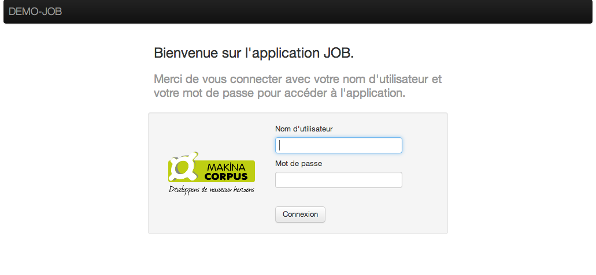

Écran de connexion

.fx: gmao_image

--------------------------------------------------------------------------------

# GMAO > Tableau de bord métier : piloter l'activité

Vue d'ensemble des interventions et des missions ; alertes sur les équipements et les contrats

Tableau de bord

.fx: gmao_image

# Presenter Notes

* Interventions : en cours, planifiées, en préparation, clôturées
* Le tableau bord est personnalisé en fonction du profil. Un technicien y retourve son planning et la liste des rapports d'intervention qu'il doit remplir.

--------------------------------------------------------------------------------

# GMAO > Constitution technique des équipements

Description des équipements faisant l'objet d'interventions de maintenance (ex : camion, dépôt pétrolier, station service)

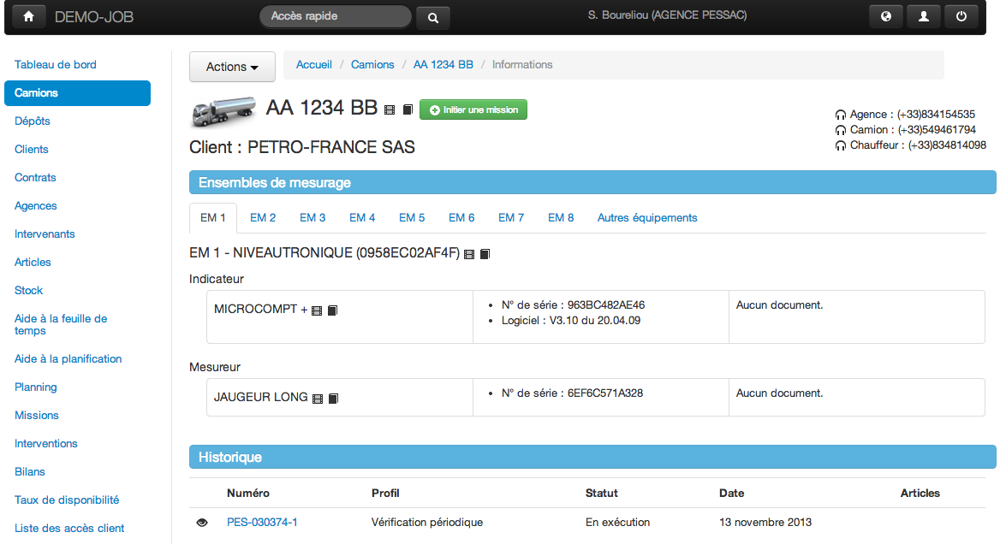

Fiche d'un camion citerne

.fx: gmao_image

--------------------------------------------------------------------------------

# GMAO > Constitution technique des équipements

Possibilité de développer de nouveaux types d'équipements (ex : éolienne, pipeline, station de mesure, téléphérique, ascenseur, ...)

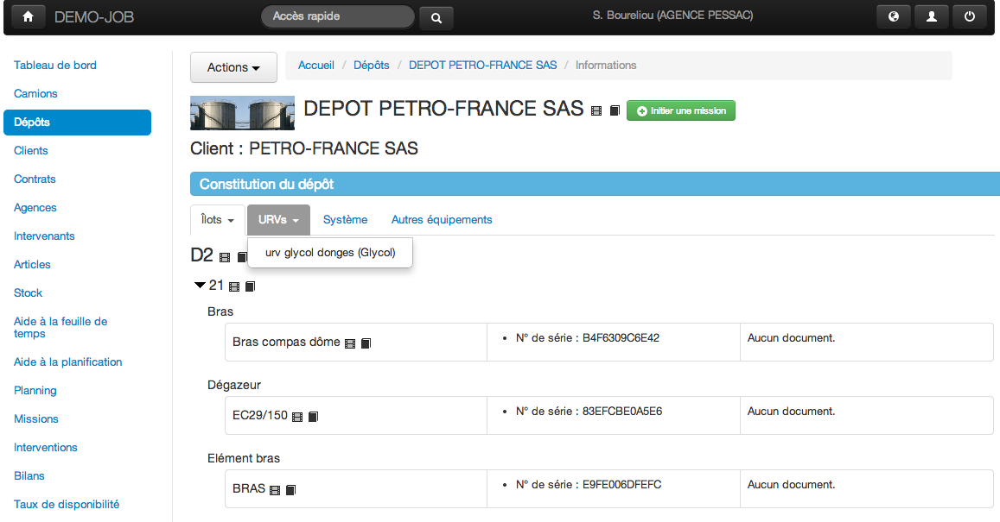

Fiche d'un dépôt pétrolier

.fx: gmao_image

--------------------------------------------------------------------------------

# GMAO > Les clients

Synchronisation de la DB clients avec la BD ERP/CRM (ex : Ciel Quantum, Sage, ERP maison, SugarCRM...)

Fiche client

.fx: gmao_image

--------------------------------------------------------------------------------

# GMAO > Les clients

Possibilité de compléter la fiche client (adresses, instructions particulières, documentations, ...)

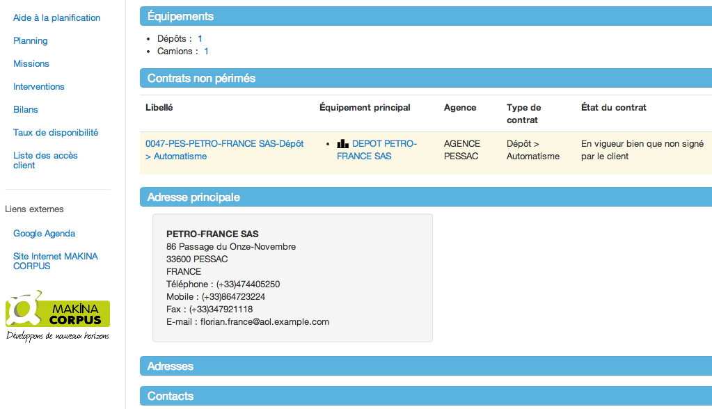

Suite de la fiche client

.fx: gmao_image

--------------------------------------------------------------------------------

# GMAO > Les contrats

Des contrats en lien avec les clients, les équipements et les interventions. Alertes et bilans.

Gestion de contrat

.fx: gmao_image

--------------------------------------------------------------------------------

# GMAO > Organisation mono ou multi-agences

Organisation des responsables et des techniciens par agence

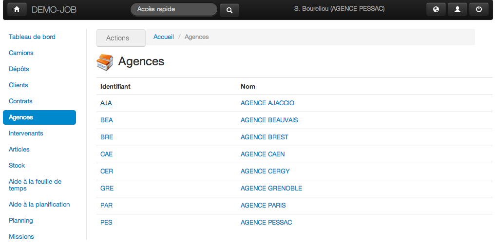

Liste des agences

.fx: gmao_image

--------------------------------------------------------------------------------

# GMAO > Organisation mono ou multi-agences

Tableau de bord, planning et bilans par agence

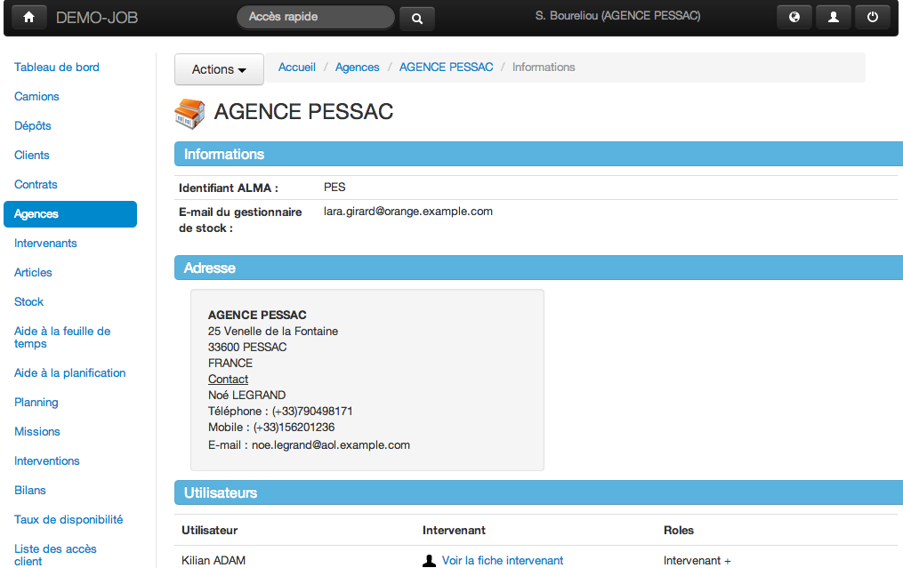

Détail d'une fiche agence

.fx: gmao_image

--------------------------------------------------------------------------------

# GMAO > Les intervenants

Liste des intervenants réalisant les opérations de maintenance

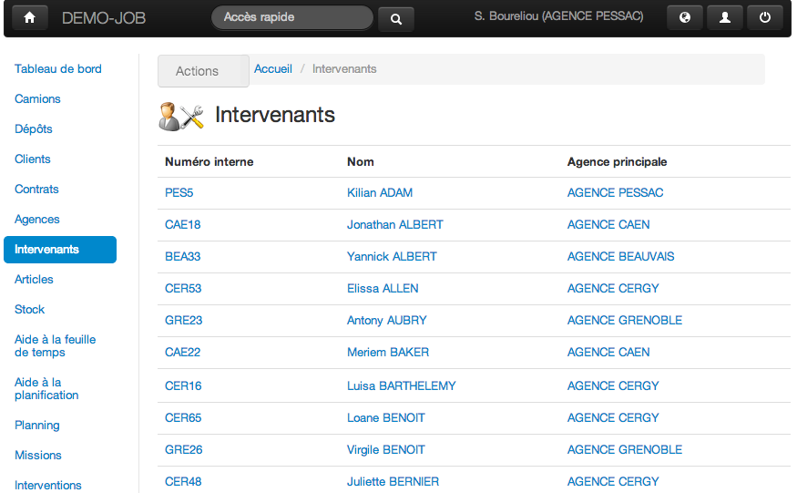

Liste des intervenants

.fx: gmao_image

--------------------------------------------------------------------------------

# GMAO > Les intervenants

Saisie des rapports d'intervention par les intervenants

Détail d'une fiche intervenant

.fx: gmao_image

--------------------------------------------------------------------------------

# GMAO > Les pièces détachées

Module « Articles » : Synchronisation de la DB pièces détachées avec la BD ERP

Détail d'une fiche article

.fx: gmao_image

--------------------------------------------------------------------------------

# GMAO > Les stocks de pièces détachées

Module « Stocks » : Visualiser le contenu des stocks issu de l'ERP

Consultation des stocks de pièces détachées

.fx: gmao_image img_w75percent

--------------------------------------------------------------------------------

# GMAO > Aide à la feuille de temps

Suivi des heures réalisées en intervention

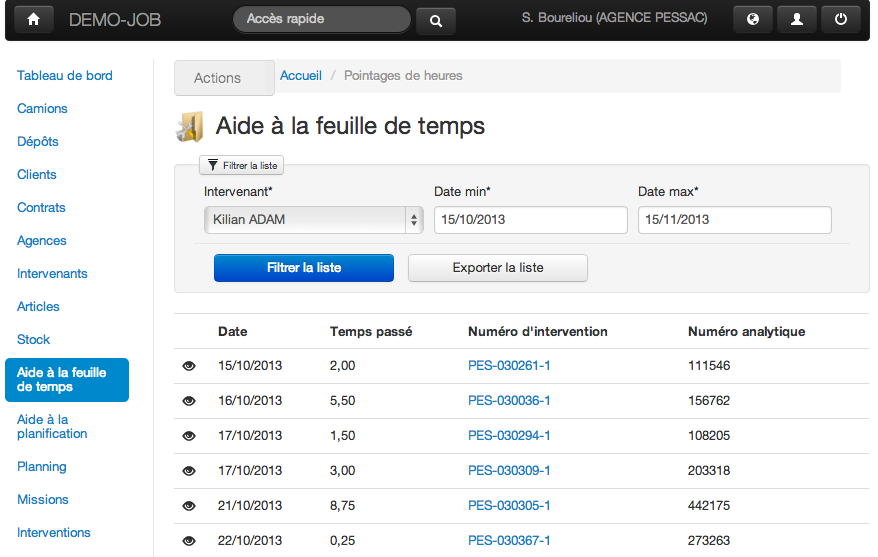

Consulter ses heures réalisées en intervention

.fx: gmao_image

# Presenter Notes

Cela peut aider par exemple à la saisie des feuilles de temps par les employés

--------------------------------------------------------------------------------

# GMAO > Aide à la planification

Planifier en avance les interventions récurrentes

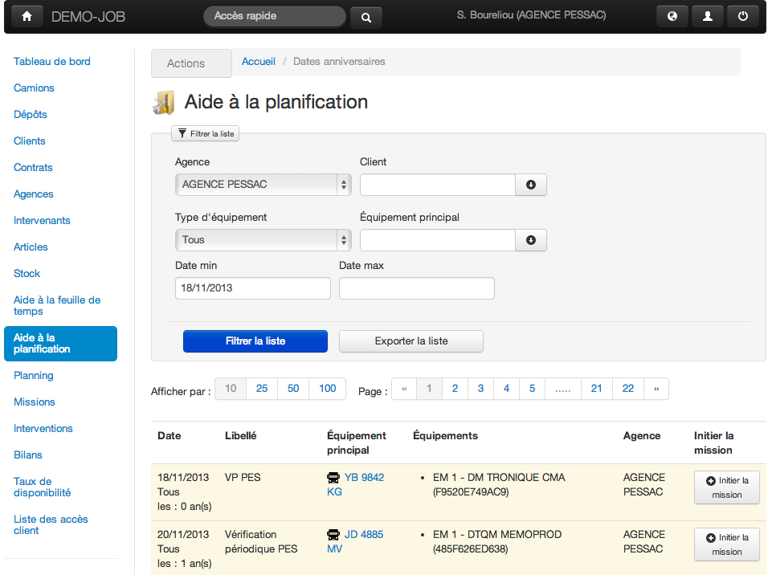

Planifications d'interventions récurrentes

.fx: gmao_image img_w85percent

# Presenter Notes

* Plus qu'une aide à la saisie, ce module permet de préparer en avance son planning avec toutes les interventions à venir connues.

* Des alertes informent en temps voulu les planificateurs de la nécessité de planifier une intervention.

--------------------------------------------------------------------------------

# GMAO > Planning

Suivi des interventions par agence, équipe et intervenant. Synchronisation avec des agendas du marché.

Interventions planifiées à venir

.fx: gmao_image img_w90percent

# Presenter Notes

* Agenda comprenant un calendrier par intervenant.
* Cela offre une solution simple pour partager facilement des calendriers, et permet d' y accéder depuis son smartphone.

--------------------------------------------------------------------------------

# GMAO > Le rapport d'intervention

Revue de contrat, préparation, planification, rapport PDF, pré-facturation

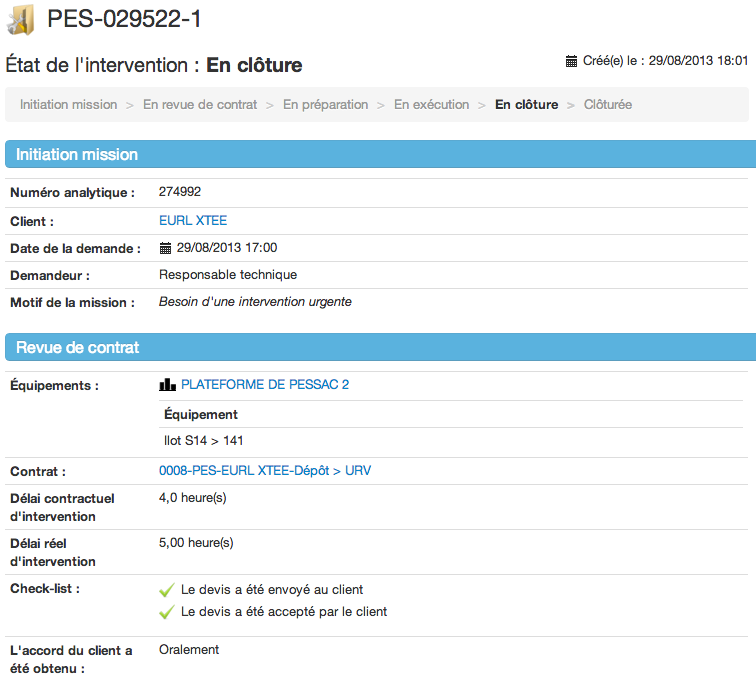

Rapport d'intervention : iniation de la mission et revue de contrat

.fx: gmao_image img_w65percent

# Presenter Notes

* De la revue de contrat jusqu'à l'envoi du rapport PDF au client ainsi qu'un document de pré-facturation à l'ERP
* Les interventions de maintenance sont réalisées par les intervenants sur les équipements.
* Les étapes du cycle de vie sont organisées ainsi : Initiation mission, Revue de contrat, Préparation intervention, Exécution intervention (rapport de l'intervenant en mobilité), Clôture intervention, Intervention clôturée et mission pré-facturée.
* Il y a également un module activant la géolocalisation du lieu au moment de l'envoi du rapport PDF au client.
* 13-intervention-2.png
* 13-intervention-3.png

--------------------------------------------------------------------------------

# GMAO > Préparation de facture

Imprimable en PDF, transmission à l'ERP pour facturation

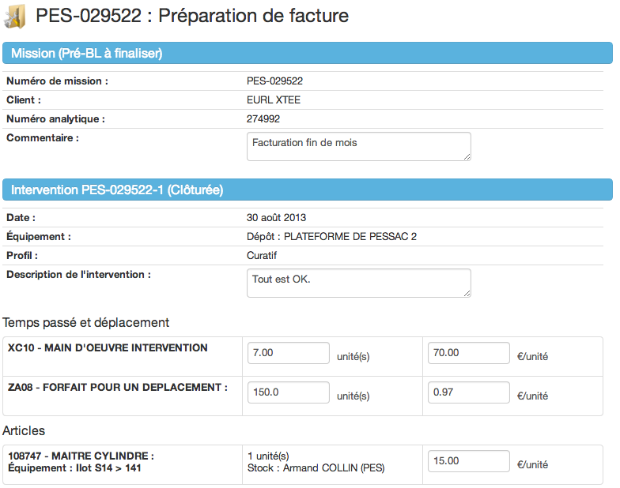

Préparation de facture

.fx: gmao_image img_w75percent

# Presenter notes

* Rappel de la mission, du client, des temps passés, des déplacements et articles consommées

--------------------------------------------------------------------------------

# GMAO > Bilans et statistiques

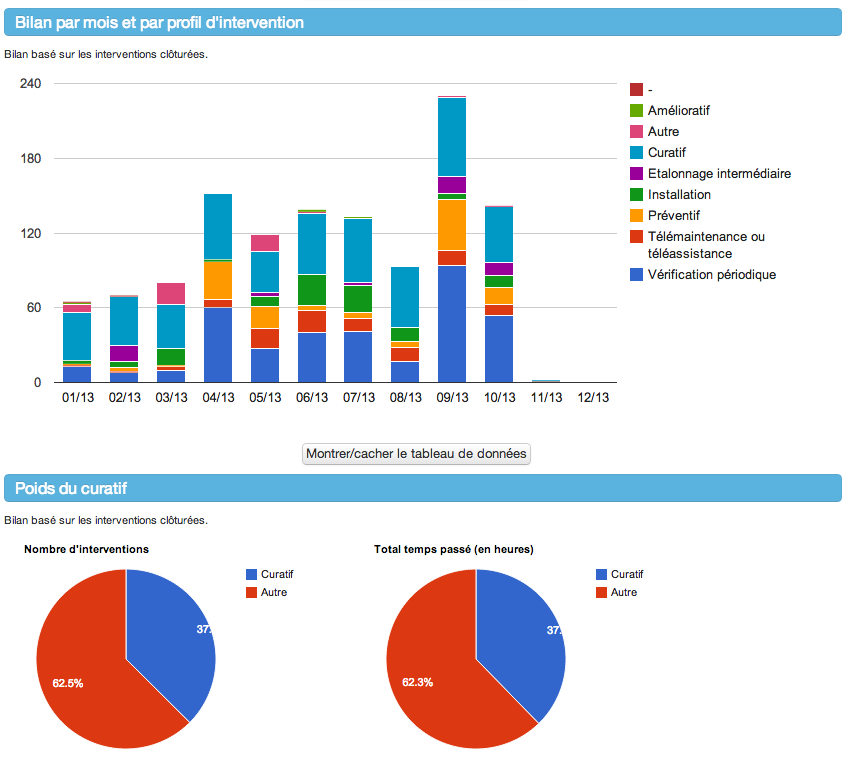

Bilans et indicateurs par agences

.fx: gmao_image img_w70percent

# Presenter notes

* Bilan par agence
* Indicateurs de bonne utilisation
* Par profil d'intervention
* Poids du curatif
* Consommation articles
* Taux de disponibilité

--------------------------------------------------------------------------------

# GMAO > Bilans et statistiques

Bilans par profil d'intervention

.fx: gmao_image

--------------------------------------------------------------------------------

# GMAO > Bilans et statistiques

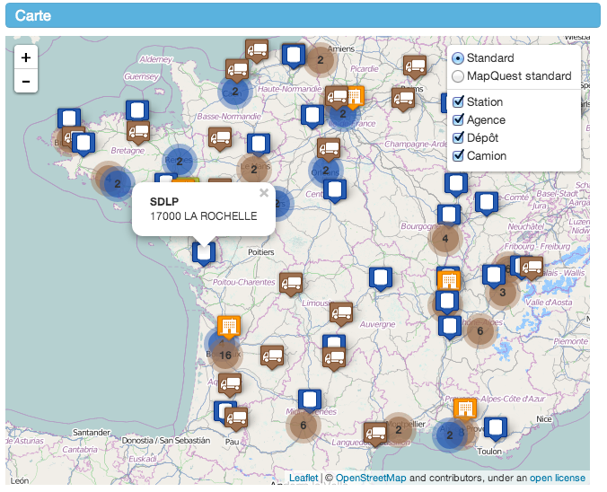

Carte des équipements et des agences

.fx: gmao_image img_w85percent

--------------------------------------------------------------------------------

# GMAO > Utilisation en mobilité

Utilisation depuis une tablette

.fx: gmao_image img_w80percent

# Presenter notes

* L’application peut être utilisée dans le navigateur d'un smartphone ou d'une tablette connectée à Internet

--------------------------------------------------------------------------------

# GMAO > Utilisation en mobilité

Utilisation depuis une smartphone

.fx: gmao_image img_w90percent

--------------------------------------------------------------------------------

# Les outils Open Source utilisés > Pour le développement

*   Interface utilisateur :
    * [Twitter Bootstrap](http://getbootstrap.com/)
    * [JQuery](http://jquery.com/)
    * CSS3, HTML5
*   Framework de développement : [Django](https://www.djangoproject.com/), écrit en [Python](http://python.org/) et BDD [PostgreSQL](http://www.postgresqlfr.org/)
*   Modules Django issus de la communauté : gestion de workflow, génération de PDF, support LDAP, etc.
*   Tests automatisés : [Jenkins](http://jenkins-ci.org/)
*   Déploiements automatisés : [Fabric](http://fabric.readthedocs.org/)
*   Worflow de développement avec [Git](http://git-scm.com/), un gestionnaire de code source décentralisé

En savoir plus sur le blog de Makina Corpus : [les outils](http://makina-corpus.com/blog/metier/2013/les-technologies-utilisees-dans-notre-gmao-job), [le workflow de développement avec Git](http://makina-corpus.com/blog/metier/2014/un-workflow-git-efficace-pour-les-projets-a-moyen-long-terme)

# Presenter Notes

* Twitter Bootstrap : collection d'outils idéale pour la création d'applications métier. Nombreux composants pour des interfaces efficaces et responsives : système de grilles, formulaires, boutons, labels et badges, tooltips, barre de navigation, etc.
* JQuery : boîte à outil indispensable du ninja JavaScript, API cross-browser pour la manipulation du DOM HTML, la gestion des animations, des événements utilisateur, création d'interfaces Ajax.
* Django : Orienté MVC, en adapté pour le dev d'applications métier, connectable aux principales BDD SQL du marché.
* Tests automatisés (87%): assurer la maintenance de son application et ajouter sereinement de nouvelles fonctionnalités ! => Tests unitaires et fonctionnels rejoués à chaque commit, et si le build ne passe pas les développeurs sont prévenus par email en temps réel
* Déploiements automatisés : nouvelle instance, màj, restauration.
* GIT : gestionnaire de code source décentralisé, workflow optimal plusieurs développeurs (branches dédiées), releases régulière par un mainteneur (review, merge, deploy), plusieurs serveurs, déploiement automatisé

--------------------------------------------------------------------------------

# Les outils Open Source utilisés > Côté système

* Système d'exploitation : [Debian](http://www.debian.org/)
* Gestion des machines virtuelles : [KVM](http://www.linux-kvm.org) (Kernel-based Virtual Machine)
* Redondance des machines virtuelles hébergées sur deux serveurs miroirs : [DRBD](http://www.drbd.org/) (Distributed Replicated Block Device)
* Supervision : [Nagios](http://www.nagios.org/)
* Gestion centralisée des comptes utilisateurs et de l’authentification aux applications : [OpenLDAP](http://www.openldap.org/), [FusionDirectory](http://www.fusiondirectory.org/)

# Presenter Notes

* Améliorer la sécurisation et l'hébergement des applications.
* KVM : Solution de virtualisation
* DRBD : Réplication de périphériques de bloc (disques, partitions, volumes logiques etc...) entre des serveurs. Réplication en temps réel, de façon transparente, synchrone ou asynchrone. L’objectif étant de pouvoir basculer rapidement sur le serveur miroir avec le minimum de perte de données en cas de panne grave sur le serveur maître.

--------------------------------------------------------------------------------

# Contribuer en retour

Bonne pratique : redistribuer tout module réutilisable à la communauté, alimenter le cercle vertueux.

Deux contributions issues du projet :

* [django-db-faker](https://github.com/fle/django-db-faker) : Module façilitant l'anonymisation des données d'une base de données Django.
* [django-jsignature](https://github.com/fle/django-jsignature) : Module intégrant le module JQuery [jSignature](https://github.com/brinley/jSignature) pour la capture d'une signature manuelle réalisée via le navigateur.

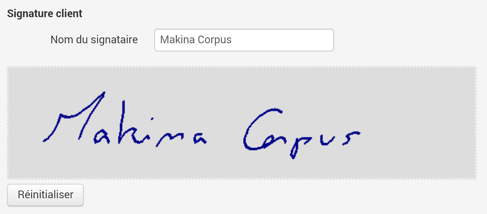

.fx: img_w75percent

# Presenter Notes

* django-db-faker : très utile pour monter une instance de démonstration en repartant d'une base contenant des données réelles de production
* django-jsignature : avec la souris ou dans l'idéal sur un écran tactile, permet au client de signer un rapport d'intervention qui lui sera transmis dans la foulée par e-mail

--------------------------------------------------------------------------------

# Gestion de projet Agile

*   Réunion hebdomadaire :
    * Démonstrations
    * Validations
    * Écriture du cahier des charges
    * Choix des prochaines tâches à traiter
* Mises en production régulières et reccueil des retours utilisateurs au plus tôt
* Prise en compte du changement

=> Obtenir une solution optimale correspondant aux besoins de ses utilisateurs

# Presenter Notes

* Avoir des échanges fréquents entre le client et son prestataire.
* Un groupe de travail complet chez le client : panel d'utilisateurs représentatif des futurs utilisateurs.
* Un cahier des charges qui s'étoffe au fur et à mesure, pas de spécifications détaillées en début de projet.
* Éviter l'effet tunnel.
* Remettre en cause à tout moment ses choix pour prendre en compte l'évolution constante de ses besoins sous toutes ses formes (évolutions simples des besoins, changement de contexte économique, survenance de difficultés techniques) et à tous les stades du projet.

--------------------------------------------------------------------------------

# Merci !    09 53 73 22 74   sylvain.boureliou@makina-corpus.com   http://makina-corpus.com

